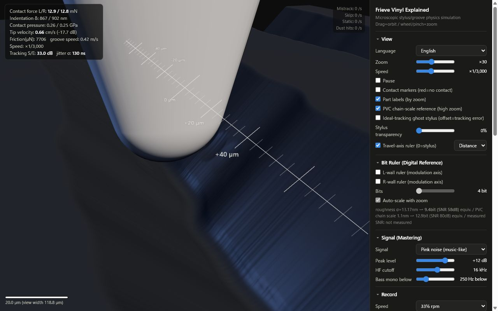
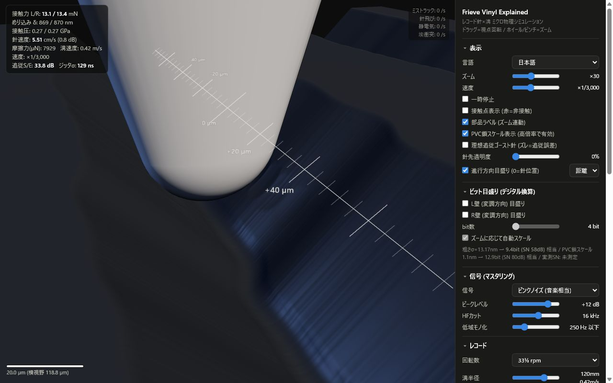

# Frieve's Sound Toolbox

---

A tool related to sound that runs on a web browser.

---

[Frieve Web Oscillator](oscillator/README.md)

An oscillator app that plays simple waveforms. [> Open App](https://frieve-a.github.io/sound_toolbox/oscillator/oscillator.html)

---

[Frieve Preview Audio Player](preview_audio_player/README.md)

A player specifically designed for the purpose of auditioning audio systems. [> Open App](https://frieve-a.github.io/sound_toolbox/preview_audio_player/preview_audio_player.html?playlist=%255B%257B%2522uri%2522%253A%2522https%253A%252F%252Fstatic.wixstatic.com%252Fmp3%252F8bc26f_13be1ecdba8c42498c0fbd6f97f9aeaa.flac%2522%252C%2522start%2522%253A562%252C%2522length%2522%253A186382.25%252C%2522memo%2522%253A%2522Keep%2520Your%2520Beliefs%2520%252F%2520Frieve-A%2522%252C%2522id%2522%253A%2522track-2%2522%257D%252C%257B%2522uri%2522%253A%2522https%253A%252F%252Fstatic.wixstatic.com%252Fmp3%252F8bc26f_13be1ecdba8c42498c0fbd6f97f9aeaa.flac%2522%252C%2522start%2522%253A111872%252C%2522length%2522%253A186382.25%252C%2522memo%2522%253A%2522Keep%2520Your%2520Beliefs%2520%252F%2520Frieve-A%2522%252C%2522id%2522%253A%2522track-1%2522%257D%252C%257B%2522uri%2522%253A%2522https%253A%252F%252Fstatic.wixstatic.com%252Fmp3%252F8bc26f_3be04b013c564d2c9f3f51692774f316.flac%2522%252C%2522start%2522%253A441%252C%2522length%2522%253A188261.04200000002%252C%2522memo%2522%253A%2522%25E3%2581%259D%25E3%2581%2586%25E3%2581%2595%25EF%25BC%2581%25E5%2583%2595%25E3%2582%2589%25E3%2581%25AF%25E3%2583%259D%25E3%2582%25B9%25E3%2583%2588%25E3%2583%2592%25E3%2583%25A5%25E3%2583%25BC%25E3%2583%259E%25E3%2583%25B3%2520%252F%2520Frieve-A%2522%252C%2522id%2522%253A%2522track-3%2522%257D%252C%257B%2522uri%2522%253A%2522https%253A%252F%252Fstatic.wixstatic.com%252Fmp3%252F8bc26f_3be04b013c564d2c9f3f51692774f316.flac%2522%252C%2522start%2522%253A17806%252C%2522length%2522%253A188261.04200000002%252C%2522memo%2522%253A%2522%25E3%2581%259D%25E3%2581%2586%25E3%2581%2595%25EF%25BC%2581%25E5%2583%2595%25E3%2582%2589%25E3%2581%25AF%25E3%2583%259D%25E3%2582%25B9%25E3%2583%2588%25E3%2583%2592%25E3%2583%25A5%25E3%2583%25BC%25E3%2583%259E%25E3%2583%25B3%2520%252F%2520Frieve-A%2522%252C%2522id%2522%253A%2522track-0%2522%257D%255D)

---

[Frieve Sound ABX Tester](sound_abx_tester/README.md)

Double-blind test game for audio files [> Open App](https://frieve-a.github.io/sound_toolbox/sound_abx_tester/sound_abx_tester.html?data=eyJuIjoiIiwidUgiOiJodHRwczovL2ZyaWV2ZS1hLmdpdGh1Yi5pby9zb3VuZF90b29sYm94L3NvdW5kX2FieF90ZXN0ZXIvOTZrMjRiaXQud2F2IiwidUwiOiJodHRwczovL2ZyaWV2ZS1hLmdpdGh1Yi5pby9zb3VuZF90b29sYm94L3NvdW5kX2FieF90ZXN0ZXIvMTI4a2Jwcy5tcDMiLCJ0VCI6IkFCUFJFRiIsImNDIjowLCJ0QyI6MCwidGMiOjIwLCJ0cyI6MH0-)

---

[Frieve Digital Sampling Visualizer](digital_sampling_visualizer/README.md)

A visual aid for learning digital sampling [> Open App](https://frieve-a.github.io/sound_toolbox/digital_sampling_visualizer/digital_sampling_visualizer.html)

---

[DSD Explained](dsd_explained/README.md)

An interactive web application that slowly animates the process of ΔΣ modulation and audio waveform reconstruction in DSD for easy understanding. [> Open App](https://frieve-a.github.io/sound_toolbox/dsd_explained/dsd_explained.html)

---

[Frieve Vinyl Explained](vinyl_explained/README.md)

A real-time WebGL simulation of a record stylus tracing a vinyl groove with microscopic physics. [> Open App](https://frieve-a.github.io/sound_toolbox/vinyl_explained/vinyl_explained.html)

---

[Earphone Cable Impact Analyzer](earphone_cable_impact_analyzer/README.md)

An interactive web application that visualizes the impact of amplifier output impedance and cable parameters on earphone frequency response. [> Open App](https://frieve-a.github.io/sound_toolbox/earphone_cable_impact_analyzer/ecia.html)

---

ブラウザ上で動作する音に関連するツールです。

---

[Frieve Web Oscillator](oscillator/README.md) 

シンプルな波形を再生するオシレーターアプリ [> アプリを開く](https://frieve-a.github.io/sound_toolbox/oscillator/oscillator.html)

---

[Frieve Preview Audio Player](preview_audio_player/README.md)

オーディオシステムを試聴する用途に特化して設計されたプレイヤー [> アプリを開く](https://frieve-a.github.io/sound_toolbox/preview_audio_player/preview_audio_player.html?playlist=%255B%257B%2522uri%2522%253A%2522https%253A%252F%252Fstatic.wixstatic.com%252Fmp3%252F8bc26f_13be1ecdba8c42498c0fbd6f97f9aeaa.flac%2522%252C%2522start%2522%253A562%252C%2522length%2522%253A186382.25%252C%2522memo%2522%253A%2522Keep%2520Your%2520Beliefs%2520%252F%2520Frieve-A%2522%252C%2522id%2522%253A%2522track-2%2522%257D%252C%257B%2522uri%2522%253A%2522https%253A%252F%252Fstatic.wixstatic.com%252Fmp3%252F8bc26f_13be1ecdba8c42498c0fbd6f97f9aeaa.flac%2522%252C%2522start%2522%253A111872%252C%2522length%2522%253A186382.25%252C%2522memo%2522%253A%2522Keep%2520Your%2520Beliefs%2520%252F%2520Frieve-A%2522%252C%2522id%2522%253A%2522track-1%2522%257D%252C%257B%2522uri%2522%253A%2522https%253A%252F%252Fstatic.wixstatic.com%252Fmp3%252F8bc26f_3be04b013c564d2c9f3f51692774f316.flac%2522%252C%2522start%2522%253A441%252C%2522length%2522%253A188261.04200000002%252C%2522memo%2522%253A%2522%25E3%2581%259D%25E3%2581%2586%25E3%2581%2595%25EF%25BC%2581%25E5%2583%2595%25E3%2582%2589%25E3%2581%25AF%25E3%2583%259D%25E3%2582%25B9%25E3%2583%2588%25E3%2583%2592%25E3%2583%25A5%25E3%2583%25BC%25E3%2583%259E%25E3%2583%25B3%2520%252F%2520Frieve-A%2522%252C%2522id%2522%253A%2522track-3%2522%257D%252C%257B%2522uri%2522%253A%2522https%253A%252F%252Fstatic.wixstatic.com%252Fmp3%252F8bc26f_3be04b013c564d2c9f3f51692774f316.flac%2522%252C%2522start%2522%253A17806%252C%2522length%2522%253A188261.04200000002%252C%2522memo%2522%253A%2522%25E3%2581%259D%25E3%2581%2586%25E3%2581%2595%25EF%25BC%2581%25E5%2583%2595%25E3%2582%2589%25E3%2581%25AF%25E3%2583%259D%25E3%2582%25B9%25E3%2583%2588%25E3%2583%2592%25E3%2583%25A5%25E3%2583%25BC%25E3%2583%259E%25E3%2583%25B3%2520%252F%2520Frieve-A%2522%252C%2522id%2522%253A%2522track-0%2522%257D%255D)

---

[Frieve Sound ABX Tester](sound_abx_tester/README.md)

音声ファイルのダブルブラインドテストゲーム [> アプリを開く](https://frieve-a.github.io/sound_toolbox/sound_abx_tester/sound_abx_tester.html?data=eyJuIjoiIiwidUgiOiJodHRwczovL2ZyaWV2ZS1hLmdpdGh1Yi5pby9zb3VuZF90b29sYm94L3NvdW5kX2FieF90ZXN0ZXIvOTZrMjRiaXQud2F2IiwidUwiOiJodHRwczovL2ZyaWV2ZS1hLmdpdGh1Yi5pby9zb3VuZF90b29sYm94L3NvdW5kX2FieF90ZXN0ZXIvMTI4a2Jwcy5tcDMiLCJ0VCI6IkFCUFJFRiIsImNDIjowLCJ0QyI6MCwidGMiOjIwLCJ0cyI6MH0-)

---

[Frieve Digital Sampling Visualizer](digital_sampling_visualizer/README.md)

デジタルサンプリングを直感的に理解するためのビジュアルな教材 [> Open App](https://frieve-a.github.io/sound_toolbox/digital_sampling_visualizer/digital_sampling_visualizer_ja.html)

---

[DSD Explained](dsd_explained/README.md)

DSDで波形をΔΣ変調および再構築するプロセスを、学習しやすいようにスローモーションでアニメーション表示 [> Open App](https://frieve-a.github.io/sound_toolbox/dsd_explained/dsd_explained.html)

---

[Frieve Vinyl Explained](vinyl_explained/README.md)

レコード針が溝をトレースする様子を、ミクロ物理でリアルタイム3D表示するWebGLシミュレーション [> アプリを開く](https://frieve-a.github.io/sound_toolbox/vinyl_explained/vinyl_explained.html#lang=ja)

---

[Earphone Cable Impact Analyzer](earphone_cable_impact_analyzer/README.md)

アンプの出力インピーダンスとケーブルパラメータがイヤホンの周波数応答に与える影響を視覚化 [> Open App](https://frieve-a.github.io/sound_toolbox/earphone_cable_impact_analyzer/ecia.html)

